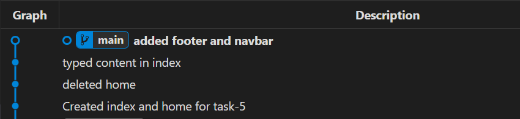

# **Version Control - Interactive Rebase (Task-5)**

## **Overview**

This README documents the process of cleaning up commit history using **Git Interactive Rebase**. The process involved squashing multiple commits into a single commit for better clarity and organization.

----------

## **Commands Used (In Order)**

```sh
# 1. Attempted to commit changes but had untracked files
git commit -am "Created index and home for task-5"

# 2. Added untracked files
git add .

# 3. Successfully committed the changes
git commit -m "Created index and home for task-5"

# 4. Added new changes (deleting home.html)
git add .

# 5. Committed the deletion of home.html
git commit -m "deleted home"

# 6. Added modifications to index.html
git add .

# 7. Committed the changes (typed content in index.html)
git commit -m "typed content in index"

# 8. Added more modifications (footer and navbar)
git add .

# 9. Committed the changes (added footer and navbar)
git commit -m "added footer and navbar"

# 10. Checked commit history before rebase
git log --oneline

# 11. Started interactive rebase for the last 4 commits
git rebase -i HEAD~4

# 12. After editing the rebase file (squashing commits), checked the updated commit history
git log --oneline

```

----------

## **Before Rebase - Commit History**

Before performing an interactive rebase, the commit history was:

```
0a87245 (HEAD -> main) added footer and navbar  
70cc81c typed content in index  
4d95cd7 deleted home  
42a2fe4 Created index and home for task-5  
```
### Git Graph - Before



----------

## **Interactive Rebase Process**

To clean up the commit history, the following command was executed:

```sh
git rebase -i HEAD~4

```

### **Rebase Actions Taken:**

-   Squashed all four commits into a single commit.
-   Updated the commit message to summarize the changes.

After saving the rebase file, Git successfully rebased and modified the commit history.

----------

## **After Rebase - Commit History**

After the rebase, the commit history became:

```
6666b4e (HEAD -> main) Created index file with footer and nav bar  
```
### Git Graph - After


Now, instead of four separate commits, we have a single commit (`6666b4e`) that includes all the changes with a clear message.

----------

